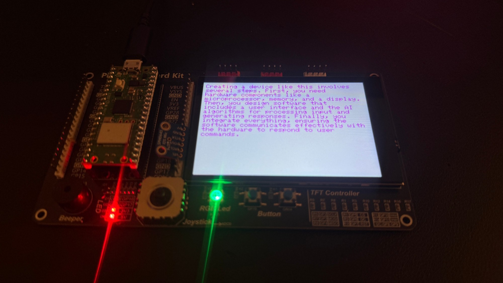
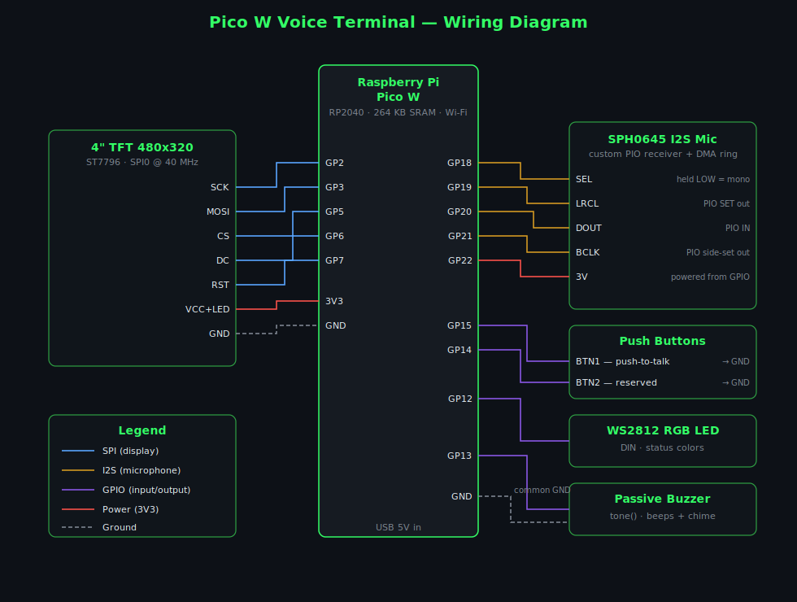

# Pico W Voice Terminal + Agent Platform

A push-to-talk voice assistant built from a Raspberry Pi Pico W and a
self-hosted agent backend.

The Pico is a **thin terminal**: press the button, speak, and the answer is
drawn on a green-phosphor CRT-style TFT. It captures audio with an I2S
microphone, streams it over a WebSocket, and displays whatever text comes
back — no keys, no memory, no agent logic on-device.

All the intelligence lives in the **backend**: a FastAPI service that
transcribes speech with Deepgram, generates replies with OpenAI (including
tool-calling), and is configured entirely through a built-in web dashboard —
API keys, model, system prompt, devices, logs, and history are all managed in
the browser, with nothing hardcoded.



More photos and a full product walkthrough: [docs/SHOWCASE.md](docs/SHOWCASE.md).

## Architecture

```
[Pico W — I/O only]                [Backend — FastAPI agent platform]
                                   ┌────────────────────────────────────────┐
 button ─▶ mic (PIO I2S)           │  /ws/voice   Deepgram STT ─▶ OpenAI LLM │
   │            │                  │                 (+ gated tool calls)    │
   │       16 kHz PCM ──── WSS ───▶│                        │                │
   │                               │   reply text ◀─────────┘                │
 TFT display ◀──── reply text ─────│                                         │
 LED + buzzer                      │  /            web dashboard (SPA)       │
                                   │  /api/*       admin REST API            │
                                   │  SQLite       settings · devices ·      │
                                   │               history · events          │
                                   └────────────────────────────────────────┘
```

- **STT:** Deepgram live streaming — the transcript is final by the time the
  button is released.
- **LLM:** OpenAI with function/tool-calling, behind a provider interface
  ([`backend/app/llm/`](backend/app/llm/)) so other providers can be added.
- **Tools:** safe built-ins are on by default; integration stubs (email,
  calendar, reminders, files, web) are **off by default and require explicit
  enable + authorize** in the dashboard before the model can use them.
- **Config:** runtime settings live in SQLite ([`backend/app/settings_store.py`](backend/app/settings_store.py));
  secrets are masked when read back and a blank field never overwrites a
  stored key.

## Repository structure

```
backend/                    FastAPI backend + web dashboard
  app/
    main.py                 app assembly and startup
    routers/voice.py        Pico-facing WebSocket (auth, PCM stream, reply)
    routers/admin.py        dashboard REST API
    llm/                    LLM provider interface + OpenAI implementation
    tools/                  tool registry, built-ins, gated integrations
    stt.py                  Deepgram live streaming client
    settings_store.py       runtime config in SQLite (secrets masked)
    db.py                   SQLite schema + helpers
    security.py             admin sessions + device token auth
    static/                 the dashboard SPA (vanilla HTML/JS/CSS)
  run.sh                    one-command local start
  test_flow_mock.py         offline end-to-end test (no keys needed)
  test_client.py            streams a WAV like a real Pico would
  Dockerfile, fly.toml      Fly.io deployment
  DEPLOY.md                 step-by-step Fly.io guide
firmware/                   Arduino sketch for the Pico W
  pico_voice_agent/         see firmware/README.md
docs/
  HARDWARE.md               bill of materials, wiring, design notes
  SHOWCASE.md               photo-documented product walkthrough
  images/                   wiring diagram + build photos
LICENSE                     MIT
```

## Hardware

Hand-wired on a breadboard — no custom PCB or prebuilt carrier:

- **Raspberry Pi Pico W** (RP2040 + Wi-Fi)
- **4" 480x320 TFT** (ST7796, SPI)
- **SPH0645 I2S MEMS microphone** (driven by a custom PIO receiver)
- **2x momentary push buttons** (push-to-talk + one reserved)
- **WS2812 RGB LED** and a **passive buzzer** for status feedback

The full bill of materials, wiring diagram, and design notes are in
[`docs/HARDWARE.md`](docs/HARDWARE.md); the pin map lives in
[`firmware/pico_voice_agent/config.h`](firmware/pico_voice_agent/config.h).
A photo-documented build walkthrough is in
[`docs/SHOWCASE.md`](docs/SHOWCASE.md).



## Software requirements

- **Python 3.11+** (backend)
- **Arduino IDE 2.x** with the Earle Philhower **arduino-pico** core (firmware)
- An **OpenAI API key** and a **Deepgram API key**
- Optional: a **Fly.io** account for cloud deployment

## Quick start

**1. Clone and start the backend:**

```bash
git clone <this-repo>
cd <this-repo>/backend
./run.sh
```

`run.sh` creates a virtualenv, installs dependencies, and serves the
dashboard at **http://localhost:8080**.

**2. First-time setup (in the dashboard):**

1. Log in with the default password `admin`; change it under
   **Config & Admin**.
2. **Providers & Keys** — paste your OpenAI and Deepgram API keys, pick a
   model, and click **Test** on each.
3. **Devices** — add a device. The dashboard shows a generated `DEVICE_ID` +
   `PICO_AUTH_TOKEN` **once**, formatted for pasting into the firmware.
4. Optional: tune the system prompt and response length under **Behavior**.

**3. Flash the Pico:**

```bash
cd firmware/pico_voice_agent
cp secrets.h.example secrets.h    # then fill in Wi-Fi + host + device token
```

Set `WS_USE_TLS 0` and your computer's LAN IP in `secrets.h` to talk to a
local backend, or leave TLS on and use your Fly.io hostname. Then follow
[`firmware/README.md`](firmware/README.md) for libraries, the one-time
TFT_eSPI pin config, and the recommended bring-up order.

**4. Talk to it.** Press Button 1, speak, press again. The reply draws on the
TFT within a couple of seconds.

### Verify without hardware

```bash
cd backend
python test_flow_mock.py          # offline: stubs Deepgram + OpenAI, tests the whole flow
python test_client.py speech.wav --token <device-token>   # streams a WAV like a Pico
```

## Deploying to Fly.io

The backend runs anywhere a container runs; a step-by-step Fly.io guide
(volume for SQLite, single always-on machine, one bootstrap secret) is in
[`backend/DEPLOY.md`](backend/DEPLOY.md). After deploying, point the firmware
at `wss://<your-app>.fly.dev` and reflash.

## Dashboard usage

Served at `/` by the backend. Tabs:

| Tab | What it does |
|---|---|
| Overview | health summary, missing-key warnings, one-click provider tests |
| Providers & Keys | OpenAI + Deepgram keys (masked once saved), model picker |
| Behavior | system prompt, temperature, max tokens, response length, history depth |
| Devices | create devices, copy the one-time token, rotate/delete, online status |
| Conversations | per-device transcript history, clearable |
| Integrations | enable/authorize tool access (off by default) |
| Logs / Events | live log tail and durable event history |
| Config & Admin | export/import config JSON, change the admin password |

## Troubleshooting

- **Pico shows `ERROR: NO WIFI`** — check `WIFI_SSID`/`WIFI_PASS` in
  `secrets.h`; the Pico W is 2.4 GHz only.
- **Pico shows `ERROR: NO SERVER LINK`** — mismatched TLS is the usual cause:
  `WS_USE_TLS` must be `1` for Fly.io (port 443) and `0` for a plain local
  `uvicorn`. Also confirm `WS_HOST`/`WS_PORT` and that the backend is
  reachable from the Pico's network.
- **`auth failed` in the dashboard Events tab** — the token in `secrets.h`
  doesn't match any device; re-copy it or rotate the token and reflash.
- **Replies are static/garbage transcripts** — validate the mic in isolation
  with `i2s_mic_debug_dump()` and tune the sample-extraction knobs; see the
  bring-up order in [`firmware/README.md`](firmware/README.md).
- **White screen** — TFT_eSPI wasn't configured; copy
  `TFT_eSPI_User_Setup.h` into the library as described in the firmware
  README.
- **"OpenAI/Deepgram key not set" errors** — keys are entered in the
  dashboard (Providers & Keys), not in `.env`.
- **Backend logs** — the dashboard's Logs/Events tabs show app-level detail;
  on Fly.io, `fly logs`.

## License

[MIT](LICENSE)
