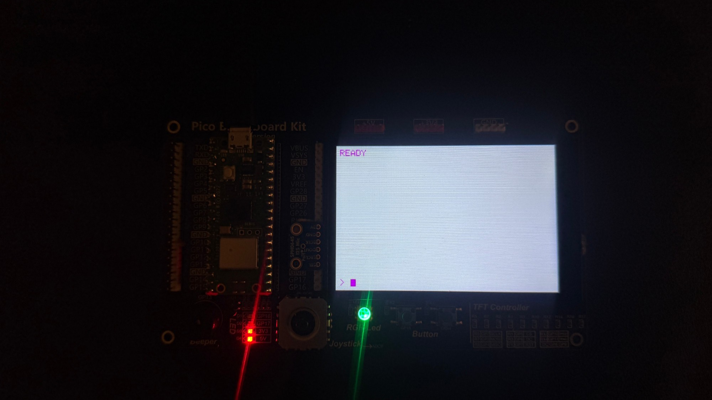
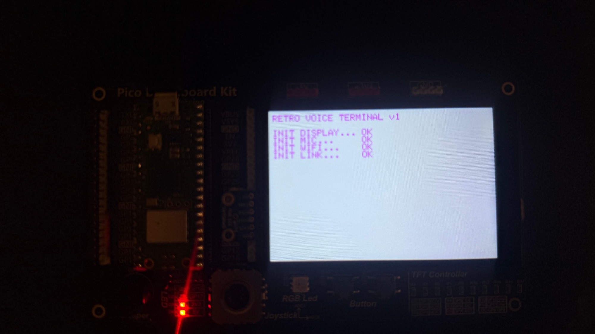
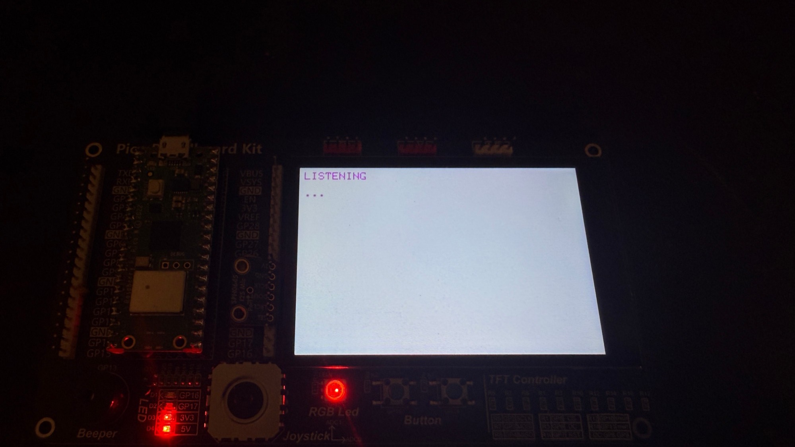

# Pico W Voice Terminal — Product Showcase

> A hand-built, push-to-talk AI voice terminal: retro green-phosphor display,
> custom PIO audio capture, and a self-hosted agent backend managed entirely
> from a web dashboard.


---

## What it is

Press the button and talk; the answer types itself onto a CRT-style green
terminal a couple of seconds later. The device itself is deliberately dumb —
a microphone, a screen, and a Wi-Fi link. Speech recognition, the language
model, tool-calling, and all configuration live in a self-hosted backend
with a web dashboard.

| | |
|---|---|
| **Interaction** | single-button push-to-talk, spoken answer rendered as text |
| **Latency** | ~2 s from button release to reply on screen |
| **Display** | 4" 480x320 TFT, phosphor-terminal aesthetic, word-wrapped |
| **Audio** | 16 kHz mono, streamed live over a WebSocket while you speak |
| **Brain** | OpenAI (dashboard-selectable model) + Deepgram streaming STT |
| **Privacy** | no audio stored anywhere; transcripts kept per-device, clearable |
| **On-device secrets** | one device token — no API keys ever touch the firmware |

---

## The build

Hand-wired on a breadboard around a Raspberry Pi Pico W — six components,
no custom PCB. Full wiring and part list in [HARDWARE.md](HARDWARE.md).


<!-- BUILD PHOTOS (to add): save into docs/images/ and uncomment —
     1) build-overview.jpg — full board from above, wiring visible
     2) build-mic.jpg — close-up of the SPH0645 mic on GP18-GP22
     3) build-display.jpg — back/side of the TFT connections


-->

The build, mid-conversation — Pico W top left, SPH0645 mic centre,
joystick/buttons and the RGB status LED below the panel:



### The interesting engineering bits

- **A hand-assembled PIO program for the microphone.** The mic's pin
  placement (LRCLK before BCLK, data between them) is impossible for the
  stock I2S library, which requires adjacent pins in a fixed order. The
  RP2040's programmable I/O doesn't care: an 8-instruction PIO program
  generates both clocks and samples the data line, and a DMA channel streams
  samples into a static ring buffer with zero CPU cost.
- **No framebuffer.** A full 480x320 frame would need more RAM than the
  RP2040 has in total. The terminal UI (boot sequence, animations, word-wrap)
  draws directly to the panel.
- **Static memory everywhere that matters.** One PCM chunk buffer, one DMA
  ring, no heap allocation in the audio/network path — the device runs for
  days without fragmentation.
- **One long-lived TLS WebSocket.** The handshake is the tightest RAM moment,
  so it happens once at boot; every conversation turn reuses the socket.

---

## The interface

The retro boot sequence reports each subsystem honestly — display, mic,
Wi-Fi, and the backend link:



Recording, with the LED solid red and the animated ellipsis ticking:



And a real, word-wrapped answer:


Every state is also visible without reading the screen:

| State | LED | Sound |
|-------|-----|-------|
| Ready | solid dim green | — |
| Recording | solid red | high beep |
| Thinking | blinking blue | low beep |
| Answer | green flash | chime |
| Error | blinking amber | long buzz |

---

## The dashboard

The backend serves a single-page admin console — everything is configured in
the browser, nothing in config files: API keys (masked once saved), model
selection, the assistant's personality, device tokens, live logs, and
per-device conversation history.

<!-- DASHBOARD SCREENSHOTS (to add): save into docs/images/ and uncomment —
     dash-overview.png — Overview tab; dash-devices.png — Devices tab
     (the token-generation flow is the money shot)


-->

Devices are provisioned like real fleet hardware: the dashboard generates a
device ID + auth token, shows the token exactly once formatted for pasting
into the firmware, and can rotate or revoke it at any time.

---

## Architecture

```
 button ──▶ SPH0645 mic ──▶ PIO + DMA ring ──▶ 16 kHz PCM over WSS ─┐
                                                                    ▼
 TFT ◀── word-wrapped reply ◀── WebSocket ◀── FastAPI backend
                                               ├─ Deepgram streaming STT
                                               ├─ OpenAI + gated tool-calling
                                               ├─ SQLite (settings/devices/history)
                                               └─ web dashboard (vanilla JS SPA)
```

The tool system is permission-gated: safe built-ins are on by default, and
integration capabilities (email, calendar, reminders, files, web) are
scaffolded but **inactive until explicitly enabled and authorized** in the
dashboard.

---

## Future work

- Implement the scaffolded integrations (email/calendar read, reminders)
  behind their existing authorization gates
- Text-to-speech reply out of the backend, played through an I2S DAC
- Second button (already wired, GP14) — conversation reset or mode switch
- Battery + enclosure for a fully standalone desk unit
- Additional LLM providers behind the existing provider interface

---

## Links

- [Repository README](../README.md) — setup and quick start
- [Hardware guide](HARDWARE.md) — BOM, wiring, design notes
- [Firmware guide](../firmware/README.md) — toolchain and bring-up
- [Backend deploy guide](../backend/DEPLOY.md) — Fly.io deployment
